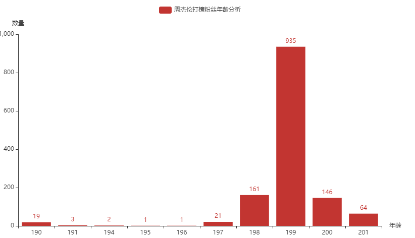
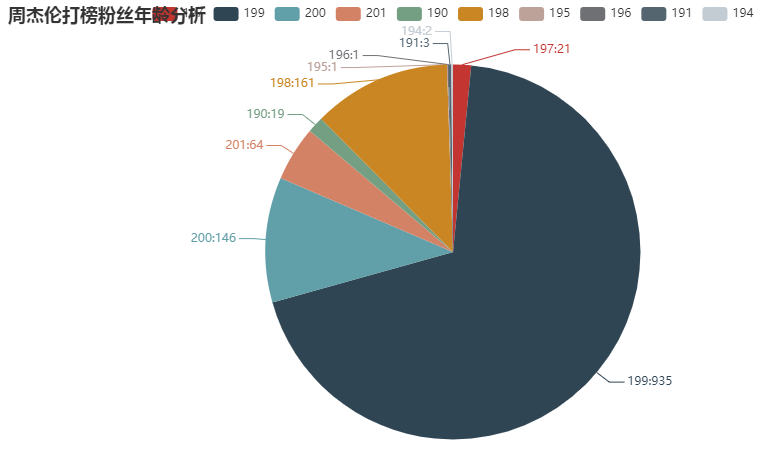
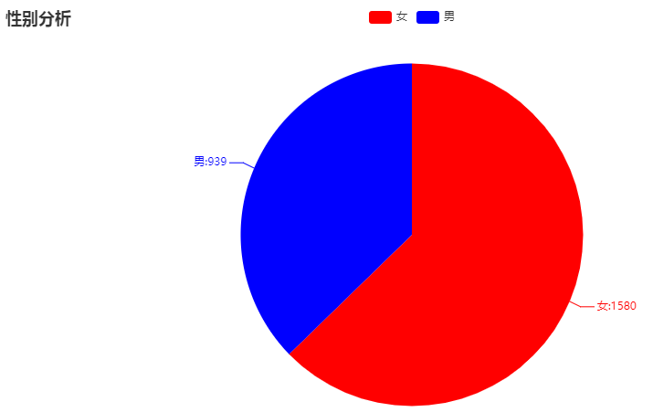
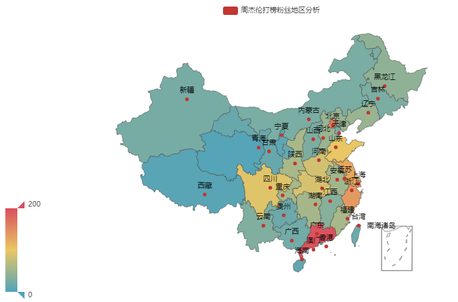

# JayWeiboSpider

实现步骤：

1、爬取`#周杰伦超话#`下的微博：[抓取微博](JayWeiboSpider.py)

2、根据每条微博爬取该用户的基本信息
- 这里使用的登录的链接是旧版的登录链接: user_info_url = 'https://weibo.cn/%s/info' % uid

```py
def spider_user_info(uid)->list:
    """
    爬取用户的信息（需要登录），并将基本的信息解析成列表返回
    : return: ['用户名', '性别', '地区', '生日']
    """
    user_info_url = 'https://weibo.cn/%s/info' % uid
    headers = {
        'Referer': 'https://m.weibo.cn/status/info?jumpfrom=wapv4&tip=1',
        'User-Agent': 'Mozilla/5.0 (Linux; Android 6.0; Nexus 5 Build/MRA58N) AppleWebKit/537.36 (KHTML, like Gecko) Chrome/71.0.3578.98 Mobile Safari/537.36'
    }
    try:
        r = s.get(url=user_info_url, headers=headers)
        r.raise_for_status()
    except:
        print('爬取用户信息失败')
        return
    # 使用正则提取基本信息
    basic_info_html = re.findall('<div class="tip">基本信息</div><div class="c">(.*?)</div>', r.text)
    # 提取：用户名、性别、地区、生日 这些信息
    basic_infos = get_basic_info_list(basic_info_html)
    return basic_infos
```

3、将信息保存到csv文件
- 使用到的模块有csv模块：

```
def save_columns_to_csv(columns, encoding='utf-8'):
    """
    将数据保存到CSV文件中
    数据格式为：'用户id','用户名','性别','地区','生日','微博id','微博内容'
    sina_columns数据格式：['用户id','用户名','性别','地区','生日','微博ID','微博内容']
    """
    with open(CSV_FILE_PATH, 'a', encoding=encoding) as csvfile:
        csv_write = csv.writer(csvfile)
        csv_write.writerow(columns)
```

### [数据分析](DataAnalysis.py)

4、使用数据分析用户的年龄、性别分布
- 效果显示：




5、分析粉丝团的地区分布
- 效果显示：


6、使用词云分析打榜微博的内容
- 效果显示：


